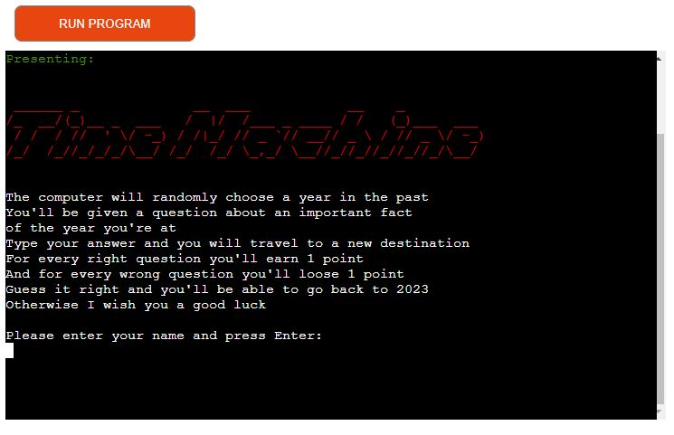
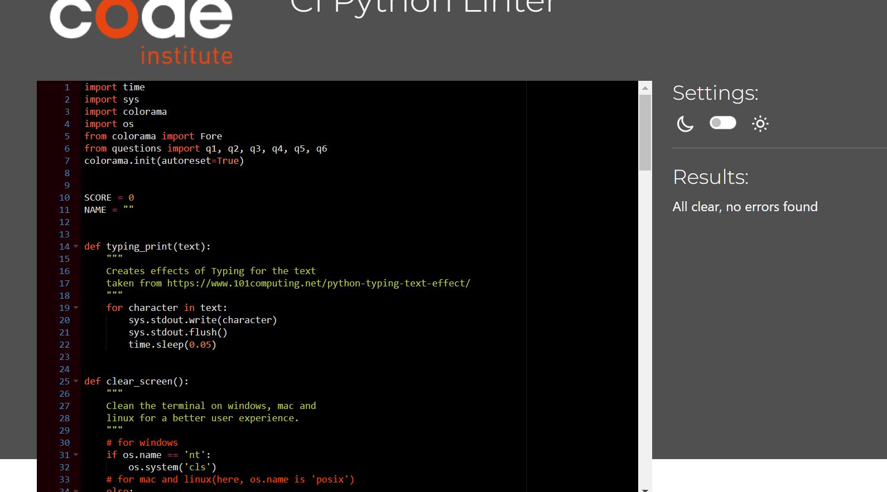

# Time Machine

Time Machine is a quiz game developed as a a Project 3 for Code Institute’s Full-Stack Web Development course.

The idea of the game is that the user enters a Time Machine which will travel to different historic moments of the world.
The user needs to guess all the answers correct in order to go back to the present(2023). 

Play the game [here](https://time-machine-game.herokuapp.com/)

## CONTENTS

* [How to play](#how-to-play)

* [User Experience](#user-experience)
  * [Project Goals](#project-goals)
  * [User Expectations](#user-expectations)

* [Features](#features)
  * [Welcome Logo](#welcome-logo)
  * [Introduction and Instructions](#introduction-and-instructions)
  * [Questions](#name-input)

* [Flow Chart](#flow-chart)

* [Validation](#validation)

* [Technologies Used](#technologies-used)
  * [Languages Used](#languages-used)
  * [Python Modules](#python-modules)
  * [Frameworks and Programs used](#frameworks-and-programs)

* [Deployment](#deployment)

* [Testing](#testing)

* [Credits and References](#credits-and-references)

---

## How to Play
 1. - In the beginning of the game you will be asked to enter your username, choose a name and press enter.

 2. - The game will load and you will get 6 different questions with 3 answer options (a,b or c). Answer the questions with the letter which has the correct answer.

 3. - Answer all the questions then you will see your total score.  If you get all 6 questions right you'll receive a Well Done message.

 4. - You can repeat the game or finish it.

## User Experience

### Project Goals
 - Develop a quiz game using Python
 - Present the quiz in a clean and easy to understand manner
 - Keep good UX principles regarding colours/interaction
 - Robust Python code without issues/bugs
 - Provide the user some knowledge about important historic facts

### User expectations

* Easy to play, fun quiz game
* Able to quickly understand the purpose of the game
* Able to find instructions
* Wants to know their progress during the game
* Able to have another try on the game or end it 

## Features

### Application Elements

The below elements are available to be experienced by the user across the quiz game application as a whole.

### Welcome Logo

* Quote and ASCII art

### Introduction and instructions 

* Shows the story of the game, the rules and asks for the username 

* Asks if the user wants to start the game
* If the user answer "y" the quiz starts

* If the user answer "n" the it gives another chance to input y, if not it ends the game

### Questions

* The Quiz contains 6 questions, with 3 choices each

* If the user answer all 6 questions right a special "Well Done" message appears
* At the end the user can choose if wants to play the quiz again, if yes the game restarts 

* If the user insert a different input than a,b or c it shows incorrect and goes back to the same question

## Flow Chart

## Validation

### PYTHON

Code Institute's [Python Linter](https://pep8ci.herokuapp.com/) was the main resouce during the code validation process. The relevant code passes with overall success with occassional minor warnings.

PEP8 Validation: run.py

## Technologies Used

#### Language Used
  - Python: to develop the program.

#### Python Modules
  - [os](https://docs.python.org/3/library/os.html?highlight=os#module-os) - to clear the screen.
  - [sys](https://docs.python.org/3/library/sys.html?highlight=sys#module-sys) - to create Typing_print effect
  - [time](https://pypi.org/project/time/) - to add pauses at certain points during the quiz.
  - [colorama](https://pypi.org/project/colorama/) for adding a colour to the different parts of quiz.

#### Frameworks and Programs used

This Project used:

  - [Git](https://git-scm.com/) for version control.
  - [GitHub](https://github.com/) to store the project files.
  - [Heroku](https://www.heroku.com/about) to deploy the website.
  - [Lucidchart](https://www.lucidchart.com/pages/) to create the flow chart.

## Deployment

### Creating the Repository

I have used the [Code Institute Python Essentials Template](https://github.com/Code-Institute-Org/python-essentials-template) 
for creating a terminal where my Python code will generate its output. The steps were as follows:

- Click the Use this template button
- A New Repository page will appear, write a Repository name and a short description and press Create repository from template
- Press the green Gitpod button to create your project workspace and start developing your website

### Deploying on Heroku

- Create an account and login into Heroku website
- Click "New -> Create new app" button
- Insert your app's Name and Choose your region then click the "Create App" button
- Into the Settings tab go to "Config vars" section and click "Reveal Config Vars"
- Enter the PORT in the KEY section and 8000 for its value, then click "Add"
- Go to "Buildpacks" section and click "Add buildpack"
- Firstly add the Python buildpack then NodeJs
- Into the Deploy tab go to "Deployment method" and select Github
- After that go to "App connected to GitHub" and look for your GitHub repository name to link it
- You can now choose to either manually or automatically deploy your app to Heroku
- I chose manually deploy
- Manual deploys means your app will be updated only when you manually click to deploy it
- When the deploying is finished, a link will be provided to you for accessing your app

The live link can be found [here](https://time-machine-game.herokuapp.com/)

## Testing

<table>
  <tr>
    <th>Test</th>
    <th>Completed Succsessfully</th>
  </tr>
  <tr>
    <td>The terminal has no issues and is working properly</td>
    <td>Yes</td>
  </tr>
  <tr>
    <td>The input for name has the right behaviour and shows the user an alert if the input has unexpected characters</td>
    <td>Yes</td>
  </tr>
  <tr>
    <td>The welcome message and game rules appear without any issues</td>
    <td>Yes</td>
  </tr>
  <tr>
    <td>The option to press 'y' to start a game is running well and gives the user another chance if it enters 'n'</td>
    <td>Yes</td>
  </tr>
  <tr>
    <td>The quiz questions run without any issues and as expected(progressing through the years)</td>
    <td>Yes</td>
  </tr>
  <tr>
    <td>Correct/Incorrect answer message appears without any issues and shows the user their current score</td>
    <td>Yes</td>
  </tr>
   <tr>
    <td>The same question appears if the user answer is invalid</td>
    <td>Yes</td>
  </tr>
   <tr>
    <td>The final score runs without any issues and as expected</td>
    <td>Yes</td>
  </tr>
  <tr>
    <td>The special message appears if the user guess all questions right</td>
    <td>Yes</td>
  </tr>
  <tr>
    <td>The user can choose if wants to play again or quit the game wihtout any issues</td>
    <td>Yes</td>
  </tr>
  <tr>
    <td>The quiz restarts at the name input section(not at the welcome message) if the user decides to run it again</td>
    <td>Yes</td>
  </tr>
</table>

### Manual testing

I have carried out the following manual tests throughout the development process:

  - Given invalid input at each input stage to check invalid data is dealt with in the way I expected.
  - Tested in my local terminal and the deployed Heroku terminal.
  - Asked friends and family to play the quiz to check that it works on various browsers and that the quiz functionality is understandable.

## Credits and References

- [Code Institute template](https://github.com/Code-Institute-Org/python-essentials-template "Link to CI Python template") was used to start the project.
- [101Computing](https://www.101computing.net/python-typing-text-effect/ "Link to 101 Computing") for clear screen and type effect references
- [Love Sandwiches]() Exporting results functionality based on Love Sandwiches Walkthrough project by Code Institute.
- [W3Schools](https://www.w3schools.com/): This website has been key in understanding and getting further practice with various approaches to coding with Python3.
    - [Python Iterators](https://www.w3schools.com/python/python_iterators.asp)