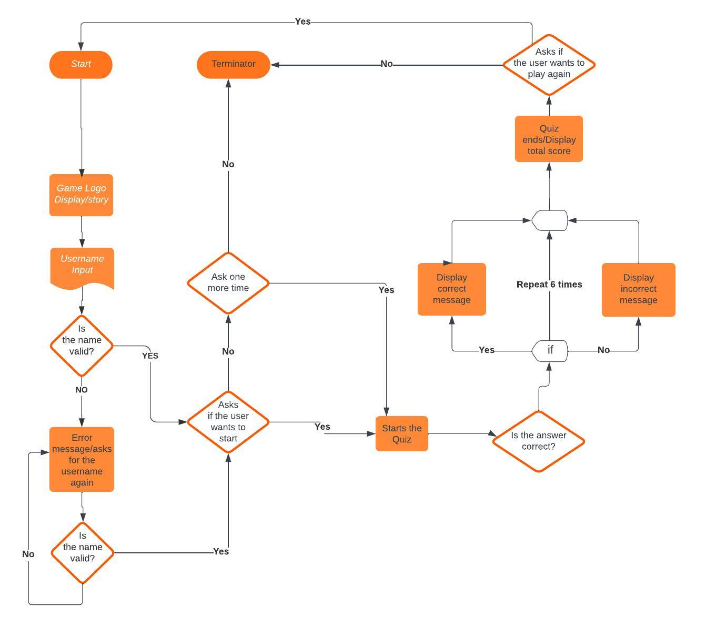

# Time Machine

Time Machine is a quiz game developed as a a Project 3 for Code Institute’s Full-Stack Web Development course.

The idea of the game is that the user enters a Time Machine which will travel to different historic moments of the world.
The user needs to guess all the answers correct in order to go back to the present(2023). 

Play the game [here]! ()

## CONTENTS

* [How to play](#how-to-play)
  * [Project Goals](#project-goals)

* [User Experience](#user-experience)
  * [User Expectations](#user-expectations)
  * [User Stories](#user-stories)

* [Features](#features)
  * [Welcome](#welcome)
  * [Story](#story)
  * [Name input](#name-input)
  * [Quiz](#quiz)
  * [Quiz end messages](#quiz-end-messages)
  * [Quiz replay](#quiz-replay)

* [Flow Chart](#flow-chart)

* [Future Implementations](#future-implementations)

* [Technologies Used](#technologies-used)
  * [Languages Used](#languages-used)
  * [Programs Used](#programs-used)

* [Deployment](#deployment)

* [Testing](#testing)

* [Credits](#credits)
  * [Code used and adapted](#code-used-and-adapted)
  * [Acknowledgments](#acknowledgments)

---

## How to Play
 1. - In the beginning of the game you will be asked to enter your username, choose a name and press enter.

 2. - The game will load and you will get 6 different questions with 3 answer options (a,b or c). Answer the questions with the letter which has the correct answer.

 3. - Answer all the questions then you will see your total score.  If you get all 6 questions right you'll receive a Well Done message.

 4. - You can repeat the game or finish it.

### Project Goals
 - Develop quiz game using Python
 - Present the quiz in a clean and easy to understand manner
 - Keep good UX principles regarding colours/interaction
 - Robust Python code without issues/bugs

## Flow Chart
